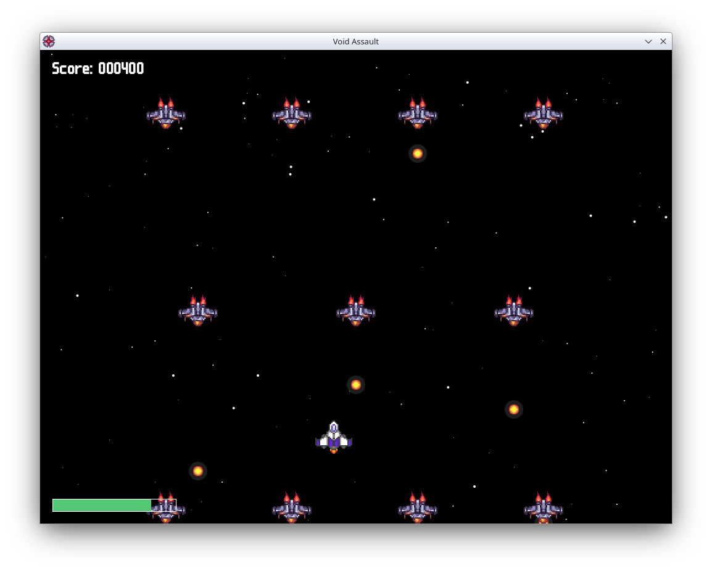

# 🚀 Void Assault

**Void Assault** is a small arcade-style vertical shooter developed using **Processing (Java)**.

This project was created as part of a **Computer Graphics assignment** in the Systems and Computer Engineering program.

The objective of the game is simple: survive enemy waves, dodge incoming fire, and defeat the final boss.

---

## 🎮 Gameplay

The player controls a spacecraft and must destroy enemy ships while avoiding enemy bullets.

During the level, several enemy types appear with different behaviors and attack patterns.  
At the end of the stage, the player must face a **boss with multiple attack phases**.

---

## ✨ Features

- 👾 Multiple enemy types
- 🧠 Different enemy attack patterns
- 💥 Explosion animations and particle effects
- 🌌 Parallax scrolling background
- 🔊 Sound effects and background music
- ⏸ Pause system
- 🏆 High score persistence

---

## 🎯 Controls

| Key | Action |
|----|------|
| ⬅️ ➡️ ⬆️ ⬇️ | Move the ship |
| SPACE | Shoot |
| P | Pause / Resume |

---

## 🛠 Technology

This project was implemented using:

- **Processing (Java)**
- Sprite-based 2D rendering
- Frame-based animations
- Simple game state management
- Event-based enemy spawning

---

## ▶️ Running the Project

1. Install **Processing**
2. Clone this repository
3. Open the sketch in Processing
4. Run the project

---

## 👨‍💻 Author

Victor Cañón